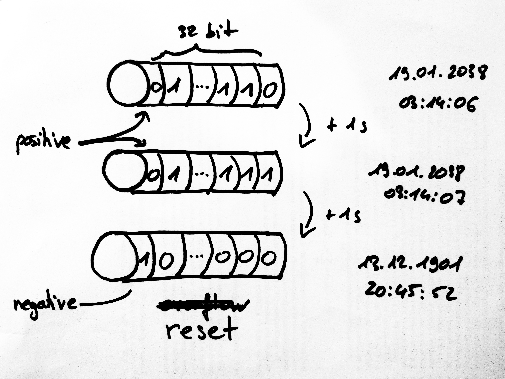

<!-- BEGIN TITLE -->
# Year 2038 Problem 
<!-- END TITLE -->

<!-- BEGIN BODY -->
The most common way to represent time in computer systems, is Unix time. It is expressed as the number of seconds elapsed since Thursday, 1 January 1970, 00:00:00 (UTC). 

Unix timestamps are stored in binary format as a string of 0's and 1's (bits). This string acts as a counter. Every second, it is incremented by one. A sign bit indicates whether the counter is negative, representing dates before 01.01.1970, or positive for dates after the beginning of Unix time.

Since the counter has a fixed number of positions, it will reset once it has reached its largest value. This will also cause the sign bit to flip around, making the timestamp negative. In many systems the counter has a size of 32 bits. Thus, on Tuesday, 19 January 2038 at 03:14:08, time will reset to Friday, 13 December 1901, 20:45:52. 

To avoid the so-called 'Year 2038 Problem', systems have to be updated with a larger counter before 2038. 

<!-- END BODY -->

## Optional text
<!-- BEGIN OPTIONAL -->
<!-- END OPTIONAL -->

## Author
<!-- BEGIN AUTHOR -->
Patrick Kahr
<!-- END AUTHOR -->
